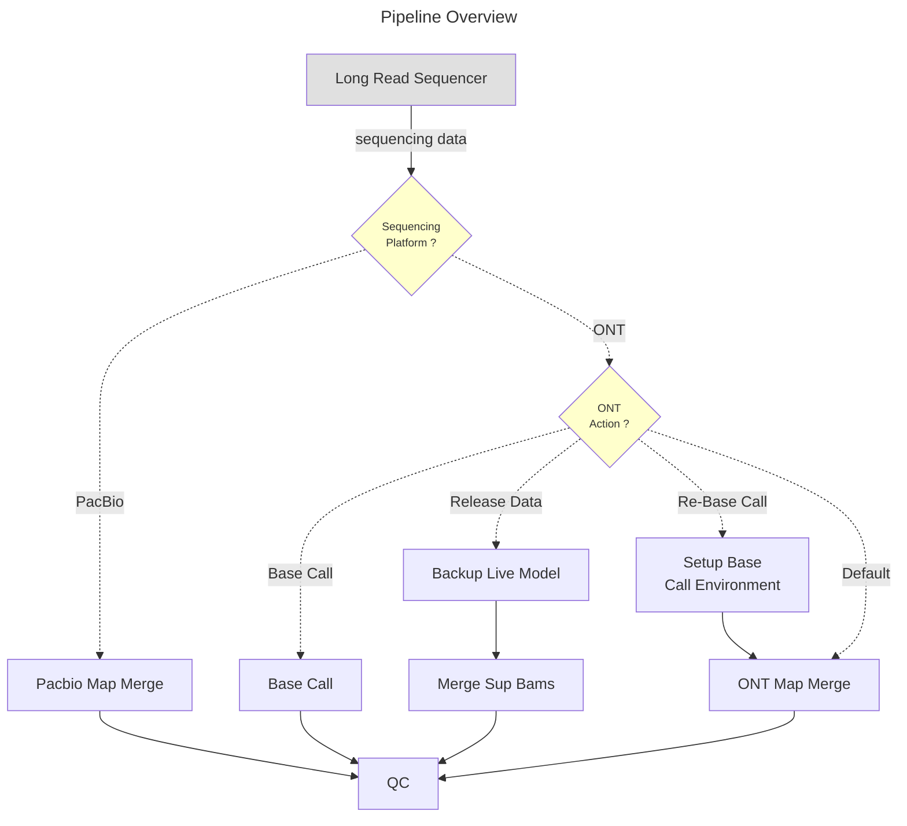
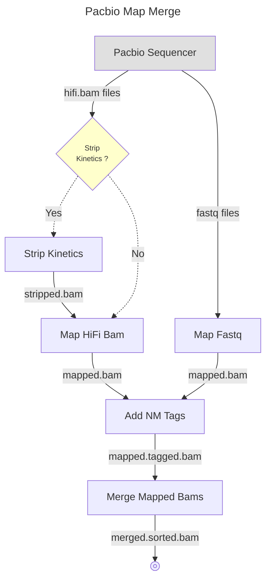

# nwgc-nf-longread-map-merge-qc

Contact: nwgc-software@uw.edu

----

## Introduction

Long Read Map Merge QC
A Nextflow pipeline to process Pacbio/ONT data through alignment, merge and qc.

```mermaid
---
title: Pipeline Overview
---
flowchart TD
A["Long Read Sequencer"] -- "sequencing data" --> B
style A fill:#E0E0E0
B@{shape: diamond, label: "Sequencing<BR>Platform ?"}
style B fill:#ffffcc
style B font-size:0.9em
B -. "PacBio" .-> C
C["Pacbio Map Merge"] --> E
B -. "ONT" .-> D
D@{shape: diamond, label: "ONT<BR>Action ?"}
style D fill:#ffffcc
style D font-size:0.9em
E["QC"]
D -. "Base Call" .-> F
F["Base Call"] --> E
D -. "Release Data" .-> G
G["Backup Live Model"] --> H
H["Merge Sup Bams"] --> E
D -. "Re-Base Call" .-> I
I["Setup Base<BR>Call Environment"] --> J
J["ONT Map Merge"] --> E
D -. "Default" .-> J
```

```mermaid
---
title: Pacbio Map Merge
---
flowchart TD
A["Pacbio Sequencer"] -- "hifi.bam files" --> B
style A fill:#E0E0E0
B@{shape: diamond, label: "Strip<BR>Kinetics ?"}
style B fill:#ffffcc
style B font-size:0.9em
B -. "Yes" .-> C
C["Strip Kinetics"] -- "stripped.bam"  --> D
B -. "No" .-> D
D["Map HiFi Bam"] -- "mapped.bam" --> E
E["Add NM Tags"]
A -- "fastq files" --> F
F["Map Fastq"] -- "mapped.bam" --> E
E -- "mapped.tagged.bam" --> G
G["Merge Mapped Bams"] -- "merged.sorted.bam" --> H
H@{shape: fr-circ}
```

